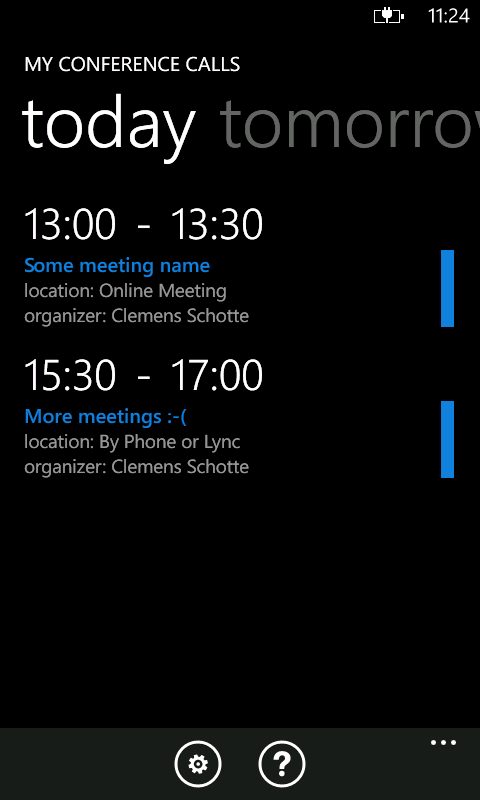

# My Conference Calls for Windows Phone

Connect to your conferences with a single tap. You don’t need to dial conference phone numbers or enter long meeting IDs.

This makes conference calls really easy and is a live saver if you need to dial-in from your car.

Basically what the app does is to show all your conference calls for the day. With one tap, you will be connected to the call. You don't need to worry about dial-in numbers, conference id's, or leader pin. This app retrieves all the information needed to dial-in directly from your calendar. Fully automated! You only have to tap the meeting in order to kick-off your call.

## License

[MIT](LICENSE)
